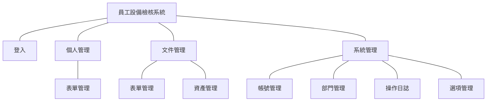
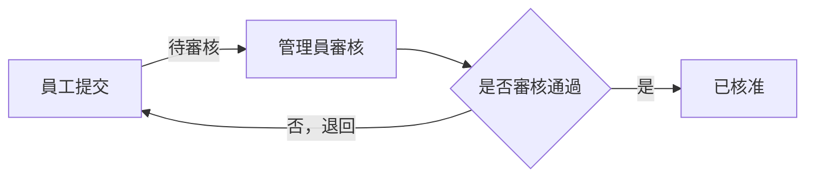

# 員工設備檢核系統

## 📋 系統開發要求

### 系統架構

---

### 表單簽核流程

---

### 系統示意圖(僅供參考)
[系統示意圖](https://www.figma.com/design/itchyUakq2OVTwVGcUsheu/%E5%93%A1%E5%B7%A5%E8%A8%AD%E5%82%99%E6%AA%A2%E6%A0%B8%E7%B3%BB%E7%B5%B1?node-id=0-1&t=9kybACF83ksYI17W-1)

### 系統選單
- 個人管理
    - 表單管理
- 文件管理
    - 表單管理
- 系統管理
    - 帳號管理
    - 部門管理
    - 操作日誌
    - 選項管理

---

### 角色權限表
| 模組      | 功能 | 一般使用者 | 管理者 | 超級管理者 |
| :---------: | :---------: | :---------: | :---------: | :---------: |
| 個人管理    | 表單管理       | V         | V            | V          |
| 文件管理    | 表單管理       | X         | V            | V          |
| 文件管理    | 資產管理       | X         | V            | V          |
| 系統管理    | 帳號管理       | X         | V            | V          |
| 系統管理    | 部門管理       | X         | V            | V          |
| 系統管理    | 操作日誌       | X         | V            | V          |
| 系統管理    | 選項管理       | X         | V            | V          |

1. 一般使用者(員工)：僅能操作個人管理模組
2. 管理者(MIS)：能操作全部模組
3. 超級管理者(RD)：能操作全部模組

---

### 功能模組說明
1. 系統必須進行登入才能進行後續功能的操作，登入頁包含`員工帳號`、`密碼`及`登入按鈕`，當點擊登入會進行帳號密碼的驗證，且帳號必須啟用才可以登入，錯誤時會顯示對應的訊息，登入成功後跳轉至系統首頁
2. 系統首頁包含`頁首(Header)`、`左側選單`，必須具備`登出`功能及顯示目前登入的`員工名稱`
3. `系統管理-選項管理`包含清單頁，`清單頁`顯示`選項類別`、`選項`、`狀態`、`備註`、`排序`、`動作`，可以依據不同類別新增/編輯/刪除底下的選項，`清單頁`必須具備分頁功能，預設排序為`排序`，
    - 狀態包含`啟用`、`停用`
    - 可進行各選項編輯、刪除動作
    - 選項類別預設值為`資產類別`，`資產類別`下選項預設值為`電腦`、`微波爐`、`冰箱`
4. `系統管理-部門管理`包含清單與明細頁，`清單頁`顯示`部門名稱`，`部門狀態`、`主管名稱`、`部門成員`、`動作(編輯、刪除)`、`查詢`，`查詢`可以針對`部門名稱`、`主管名稱`、`部門成員`進行關鍵字查詢，`清單頁`必須具備分頁功能，預設排序為`部門名稱`，，當點擊新增可以跳轉至新增部門明細頁，`明細頁`顯示`部門名稱`為文字框，`主管名稱`為下拉清單，資料來源為帳戶管理，`部門成員`為下拉多選清單，資料來源為帳戶管理，`建立人員`為新建部門時的建立者並顯示建立時間，`更新人員`為編輯部門時的編輯者並顯示編輯時間，當點擊編輯時可以異動`部門主管`、`部門狀態`、`部門成員`，不可異動`部門名稱`，明細頁在編輯動作下有提供`刪除`部門名稱功能，檢視動作下各欄位皆不可編輯
    - 部門名稱不可重複新增
    - 一名員工同一時間只能加入一個部門，部門成員下拉清單必須過濾掉已經加入部門的員工
5. `系統管理-帳號管理`包含清單與明細頁面，`清單頁`顯示`員工名稱`、`員工帳號`、`部門名稱`、`身分`、`狀態`、`動作(編輯、刪除)`、`查詢`，`查詢`可以針對`員工名稱`進行關鍵字查詢，並提供`部門名稱`、`帳號狀態`下拉查詢條件，`清單頁`必須具備分頁功能，預設排序為`員工名稱`，當點擊新增可以跳轉至新增帳號明細頁，`明細頁`顯示`員工名稱`文字框，`員工帳號`為文字框，`部門名稱`為下拉清單，資料來源為部門管理，`身分`為單選`管理者`或`一般使用者`，`分機`為文字框，`備註`為文字框，`檔案上傳-電子簽名檔`為上傳檔案功能
    - 員工名稱、員工帳號、員工部門、員工身份、分機為必填，備註為非必填
    - 狀態為`啟用`、`停用`
    - 首次建立員工帳號，員工密碼預設為`ISCOM+員工帳號`，密碼儲存格式必須加密過後寫入資料庫中
    - 簽名檔限制為`.png、.jpeg、.jpg、.gif`格式，並限制大小不可超過`5MB`
6. `系統管理-操作日誌`包含清單頁，`清單頁`顯示`操作日期`、`事件`、`操作人員`、`訊息`、`登入IP`，並提供日期、關鍵字的查詢條件，`清單頁`必須具備分頁功能，預設排序為`操作日期`降冪，並可將當前的查詢結果匯出Excel操作紀錄
    - 匯出檔名為`操作紀錄_yyyyMMddHHmmss.xlsx`，yyyyMMddHHmmss為匯出當下時間，各功能模組在進行`新增`、`編輯`、`刪除`、`匯出`時必須將事件寫入操作日誌中
7. `文件管理-資產管理`包含清單頁，`清單頁`顯示`資產編號`、`資產名稱/型號`、`資產類別`、`購買日期`、`採購人員`、`狀態`、`動作(編輯、刪除)`、`查詢`，`查詢`可針對`資產編號`、`資產名稱/型號`做關鍵字查詢，亦提供`資產類別`下拉、`購買日期`的查詢方式，`清單頁`必須具備分頁功能，預設排序為`資產編號`降冪，當點擊新增時可以使用彈窗的方式快速新增資產，也能點選編輯進行資產內容的調整，或是刪除新增錯誤的資產
    - `資產編號`編碼為`TLxxxxxx`，xxxxxx為流水號不可重複
    - `狀態`為`啟用`、`停用`
    - 編輯時不可修改`資產編號`及`資產名稱`
    - 刪除使用註記刪除的方式
8. `文件管理-表單管理`包含清單頁與明細頁面，`清單頁`顯示`年度(民國)`、`表單填寫期間(起訖)`、`表單名稱`、`發起人`、`發布狀態`、`動作(編輯、審核、刪除)`、`查詢`，`查詢`可針對`表單名稱`進行關鍵字查詢，亦提供`年度(民國)`、`表單單填寫期間`、`發布狀態`查詢方式，`清單頁`必須具備分頁功能，預設排序為`年度`、`表單填寫(迄)`降冪，當點擊新增可以跳轉至表單明細頁，`明細頁`顯示`年度(民國)`為輸入框、`表單填寫期間(起)`為日期輸入、`表單填寫期間(迄)`為日期輸入、`表單名稱`為文字框、`發起人`為下拉選單，資料來源是帳號管理，`發布狀態`為下拉選單，發布狀態包含`上架`、`下架`，當發佈狀態為上架，員工可於`個人管理-表單管理`中查看到發起的表單進行填寫，`編輯`可以異動表單資訊，也可以調整發佈狀態上下架
9. `文件管理-表單管理`當點擊`審核`按鈕，會跳轉到審核清單頁，將可看到員工已經提交之表單內容
10. `文件管理-表單管理/審核清單頁`，清單顯示欄位為`員工姓名`、`單位名稱`、`分機`、`資產編號`、`檢查日期`、`表單狀態`、`動作(編輯、匯出)`、`查詢`，`查詢`可針對`員工姓名`進行關鍵字查詢，亦提供`表單狀態`下拉查詢方式，`清單頁`必須具備分頁功能，預設排序為`員工姓名`降冪，當點擊編輯可以跳轉至審核明細頁，`明細頁`顯示`員工姓名`、`單位名稱`、`分機`、`資產編號`、`檢查日期`、`表單狀態`、`檢查項目`、`檢查狀態`、`查核紀錄`，`明細頁`有核准跟退回按鈕，當點擊核准表單狀態改為`已核准`，點擊退回則退回員工本身，表單狀態改為`退回`，員工必須修正表單問題再進行一次提交，表單狀態異動會記錄到表單審核紀錄中，審核紀錄包含`異動時間`、`異動狀態`、`異動人`，`匯出`可將表單內容以Word方式匯出，其中`權責主管`自動帶入員工主管的電子簽章，`推動小組簽章`則帶入MIS審核人員電子簽章
    - 表單狀態有三種狀態：`待審核`、`已核准`、`退回`
    - 內頁呈現表單完整資訊，包含`員工姓名`、`單位名稱`、`分機`、`資產編號`、`檢查日期`、`表單狀態`、及`各項檢查項目`，總共`10項`，每項包含`檢查狀態`及`查核紀錄`
    - 檢查項目文字可參考範本`ISMS-P-005-06個人電腦安全檢查表_V1.1.docx`
11. `個人管理-表單管理`包含清單與明細頁，`清單頁`顯示`年度(民國)`、`表單填寫期間(起訖)`、`表單名稱`、`發起人`、`發布狀態`、`動作(編輯)`、`查詢`，`查詢`可針對`表單名稱`進行關鍵字查詢，亦提供`年度(民國)`、`表單單填寫期間`查詢方式，當點擊編輯可以跳轉至表單明細頁，`明細頁`顯示`員工姓名`唯獨、`單位名稱`唯獨、`分機`唯獨、`資產編號`下拉選單，資料來源為`資產管理`且資料類別為`電腦`之資產、`檢查日期`為日期輸入、`表單狀態`、`檢查項目`、`檢查狀態`、`查核紀錄`，`明細頁`有送出按鈕，送出後表單狀態改為`待審核`，將不可再編輯送出後的表單內容，並記錄到表單審核紀錄中，`明細頁`有`審核紀錄`按鈕，點擊按鈕後可以看到該表單過去的審核紀錄，審核紀錄包含`異動時間`、`異動狀態`、`異動人`， 
    - 表單狀態有三種狀態：`待審核`、`已核准`、`退回`
    - 內頁呈現表單完整資訊，包含`員工姓名`、`單位名稱`、`分機`、`資產編號`、`檢查日期`、`表單狀態`、及`各項檢查項目`，總共`10項`，每項包含`檢查狀態`及`查核紀錄`
    - 檢查項目文字可參考範本`ISMS-P-005-06個人電腦安全檢查表_V1.1.docx`
---
### 系統框架要求
- **後端：** ASP.NET Core MVC
- **前端：** HTML、CSS、JavaScript
- **資料庫：** SQL Server
- **ORM：** Entity Framework Core

---

## 🗄️ 資料庫設計規範

### 資料表設計要求
- [ ] 所有資料表必須有主鍵
- [ ] 外鍵關聯設計正確
- [ ] 建立適當的索引
- [ ] 欄位必須包含`建立者`、`建立時間`、`編輯者`、`編輯時間`
- [ ] 欄位長度必須合理，例：員工名稱50字，不可開成MAX

### 資料庫命名規則
- **資料表名稱：** 英文複數形式，PascalCase（如：Users、EquipmentChecklists）
- **欄位名稱：** PascalCase（如：UserId、UserName、CreatedDate）
- **主鍵命名：** TableNameId 格式（如：UserId、ChecklistId）
- **外鍵命名：** 對應主鍵名稱
- **索引命名：** IX_TableName_ColumnName 格式

---

## 💻 程式碼撰寫規範

### C# 命名規則
- **類別名稱：** PascalCase
- **介面名稱：** I開頭的PascalCase
- **方法名稱：** PascalCase
- **屬性名稱：** PascalCase
- **變數名稱：** camelCase
- **私有欄位：** _camelCase（底線開頭）
- **常數：** PascalCase

### JavaScript 命名規則
- **變數名稱：** camelCase
- **函數名稱：** camelCase
- **常數：** UPPER_SNAKE_CASE
- **類別名稱：** PascalCase

### HTML/CSS 命名規則
- **CSS類別：** kebab-case
- **HTML ID：** kebab-case
- **檔案名稱：** kebab-case

---

## 🏗️ 架構設計規範

### 專案結構要求
- [ ] 採用分層架構（至少3層）
- [ ] Controller、Service、Repository 分離
- [ ] 使用依賴注入 (Dependency Injection)
- [ ] 統一的錯誤處理機制

### 程式碼組織規範
- **Controllers：** 僅處理HTTP請求/回應
- **Services：** 處理業務邏輯
- **Models：** 資料模型定義
- **RequestModel/ResponseModel：** 資料傳輸物件，不可直接將DBModel回傳
---

## 🔐 安全性要求

### 權限控制
- [ ] 實作角色權限驗證
- [ ] 使用 [Authorize] 屬性控制存取
- [ ] 不同角色有不同功能權限

### 資料驗證
- [ ] 前端JavaScript驗證
- [ ] 後端Model驗證
- [ ] SQL Injection 防護

---
## 🔄 審核流程規範

### 流程狀態
- [ ] 至少包含：待審核、已核准、退回 狀態
- [ ] 狀態轉換邏輯正確
- [ ] 審核紀錄完整保存

### 審核紀錄要求
- [ ] 記錄審核者
- [ ] 記錄審核時間
- [ ] 記錄狀態變更歷程

---

## 🎨 前端開發規範

### UI/UX 要求
- [ ] 使用者友善的操作介面
- [ ] 適當的載入提示
- [ ] 錯誤訊息顯示

### JavaScript 開發規範
- [ ] 使用AJAX進行非同步操作
- [ ] 使用jQuery進行DOM操作
- [ ] 表單驗證功能
- [ ] 適當的錯誤處理
- [ ] 程式碼模組化

---

## 📝 程式碼品質要求

### 程式碼風格
- [ ] 一致的縮排（4個空格）
- [ ] 適當的程式碼註解
- [ ] 方法長度控制（建議不超過50行）
- [ ] 類別職責單一

### 註解規範
- [ ] 公開方法必須有XML註解
- [ ] 複雜邏輯需要說明註解
- [ ] 業務規則需要註解說明

---

## 📋 交付檢查清單

### 必要文件
- [ ] TableSchema文件(Excel)
- [ ] ERD資料表關聯圖

### 程式碼要求
- [ ] 完整的原始碼
- [ ] 本次需求完整資料表語法(SQL)
- [ ] 程式碼上版控(Git)，可以是Github或Gitlab

### 系統部屬
- [ ] 佈署在個人電腦IIS上，並提供測試用連結

---

## 🗓️ 里程碑
### 第一天(9/1)
下班前以發信的方式提供以下文件
- [ ] TableSchema文件(Excel)
- [ ] ERD資料表關聯圖

### 第三天(9/3)
下班前以發信的方式提供以下文件
- [ ] 系統雛型畫面(實際)截圖
- [ ] 程式碼版控連結

### 第五天(9/5)(重要)
下班前安排及提供以下文件
- [ ] 成果展示(Demo)，提供測試站台連結
- [ ] 完整程式碼提供
- [ ] 本次需求完整資料表語法(SQL)

---
## 🏆 評分標準

### 功能完整性 (40%)
- CRUD功能完整度
- 角色權限正確性
- 審核流程完整度
- 報表功能正確性

### 程式碼品質 (30%)
- 命名規範遵循度
- 架構設計合理性
- 程式碼可讀性
- 錯誤處理完整度

### 系統設計 (30%)
- 資料庫設計合理性
- 系統架構清晰度
- 安全性考量